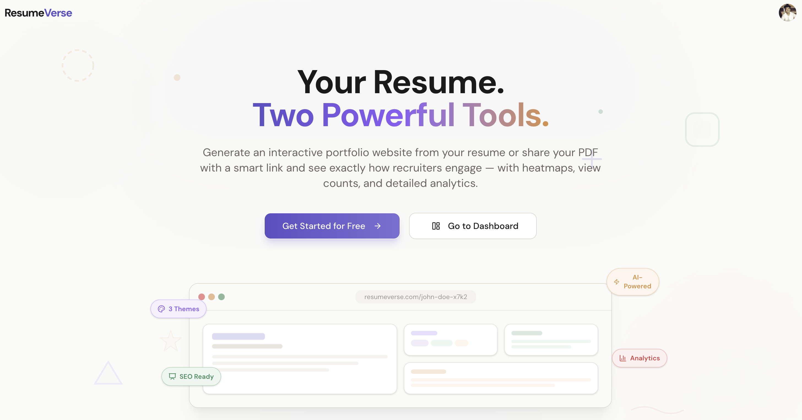
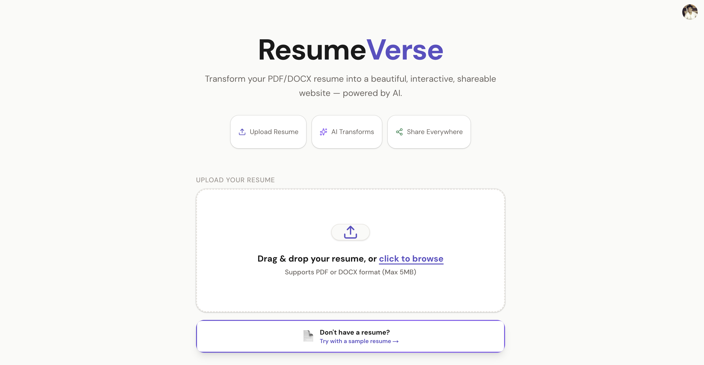
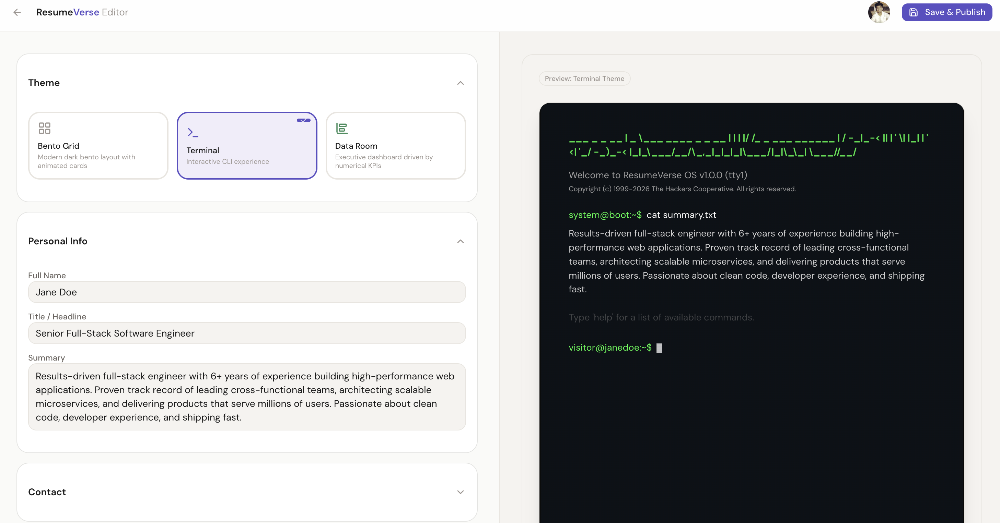
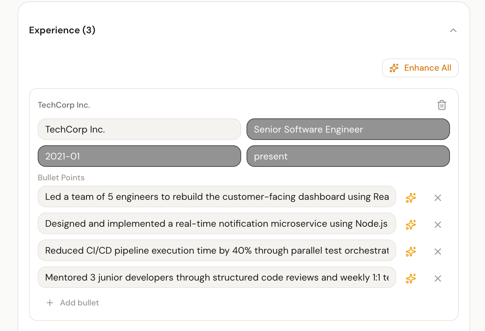
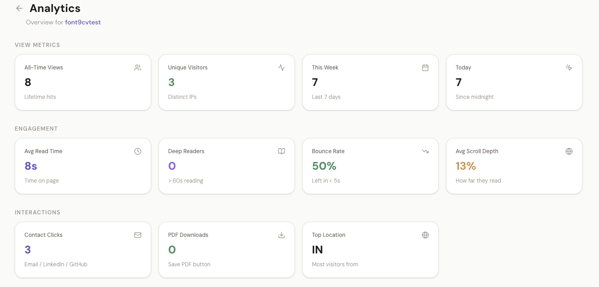
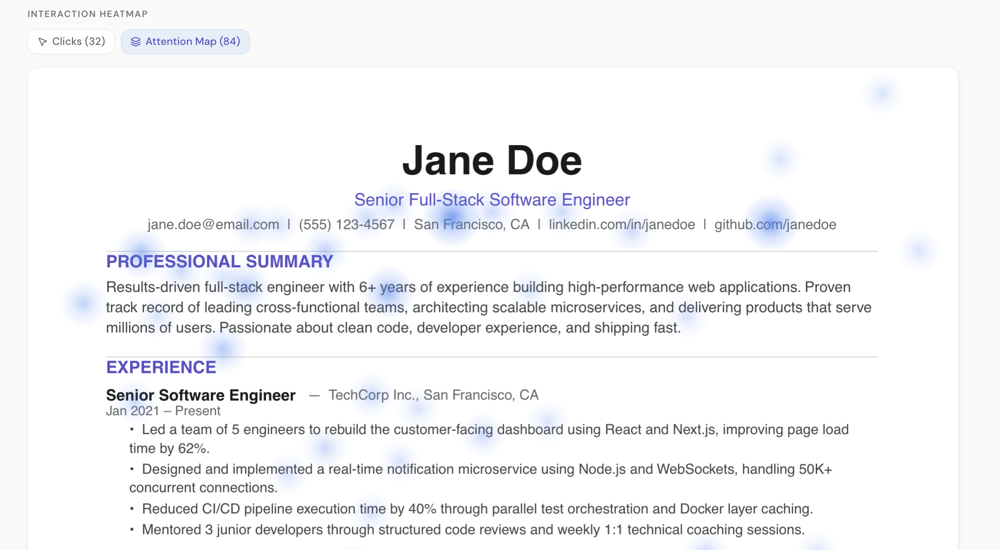

<div align="center">

# ResumeVerse

**Upload a resume. Get a live portfolio. Track who reads it.**

An AI-powered platform that transforms static PDF/DOCX resumes into interactive, themed web portfolios — complete with real-time editing, recruiter engagement heatmaps, and deep analytics.

[](https://nextjs.org/)
[](https://typescriptlang.org/)
[](https://supabase.com/)
[](https://ai.google.dev/)
[](https://tailwindcss.com/)

[Live Demo →](https://resumeverse-puce.vercel.app/) · 

</div>

---

<!-- TODO: Replace with an actual screenshot of the landing/upload page -->
<!--  -->


---

## ⚡ What It Does

| Step | Feature | What Happens |
|:----:|---------|-------------|
| **1** | **Upload** | Drop a PDF or DOCX — the AI extracts everything automatically |
| **2** | **Transform** | Generates a fully interactive web portfolio in seconds |
| **3** | **Customize** | Edit content live with a real-time WYSIWYG preview |
| **4** | **Share** | Get a shareable link and track how recruiters engage |

---

## 🎯 Core Features

### 🤖 AI-Powered Resume Parsing
- Gemini AI extracts structured data from raw PDFs/DOCX with **98%+ accuracy**
- Automatically maps experience, education, skills, and projects into a clean JSON schema
- Zero manual data entry required

<!-- TODO: Replace with a screenshot of the parsed result / editor -->
<!--  -->


---

### 🎨 3 Premium Themes with Real-Time Editing

Choose from three distinct, production-quality themes:

| Theme | Style | Best For |
|-------|-------|----------|
| **Bento** | Modern grid layout | Design-oriented roles |
| **Terminal** | Developer CLI aesthetic | Engineering roles |
| **KPI** | Data-driven dashboard | Analytics / PM roles |

- **Live WYSIWYG Editor** — edit any field and see changes reflected instantly, zero page reloads
- **One-click theme switching** with persistent data across themes

<!-- TODO: Replace with a screenshot or GIF of the real-time editor + theme switching -->
<!--  -->


---

### ✍️ AI Bullet Point Enhancer
- One-click rewrite of experience bullet points using Gemini AI
- Contextually optimizes for **action verbs**, **quantifiable metrics**, and **ATS keyword density**
- Improves simulated ATS match scores by up to **40%**

<!-- TODO: Replace with a screenshot of the AI Enhancer in action -->
<!--  -->


---

### 📊 Recruiter Engagement Analytics

Share your portfolio and get **real data** on how recruiters interact with it:

- **Normalized Heatmaps** — device-agnostic spatial heatmaps (via coordinate bucketing & opacity normalization) that visualize exactly where recruiters focus, with **95%+ positional accuracy** across viewports
- **Link Click Tracking** — track outbound clicks on GitHub, LinkedIn, portfolio, and project links
- **Deep Engagement Metrics** — unique visitors, geographic origin, scroll depth, average session duration, return visits, and download counts
- **Per-PDF Page Tracking** — for hosted raw PDFs, track reading patterns per page

<!-- TODO: Replace with a screenshot of the analytics dashboard / heatmap -->
<!--  -->



---

### 🔒 Hosted PDF Mode
- Upload and share your original PDF exactly as-is, no AI transformation
- Full tracking — heatmaps, downloads, time-on-page — still works
- One-click download button for recruiters

---

## 🛠️ Tech Stack

| Layer | Technologies |
|-------|-------------|
| **Framework** | Next.js 16, React 19, TypeScript |
| **Styling** | Tailwind CSS, shadcn/ui, Framer Motion, GSAP, Lenis |
| **AI Engine** | Google Gemini AI |
| **Backend & Auth** | Supabase (PostgreSQL, Auth, Edge Storage) |
| **Data Visualization** | D3.js, Recharts |
| **PDF Processing** | pdf-parse, PDF.js, react-pdf |
| **Rich Text Editing** | TipTap |
| **Testing** | Vitest, React Testing Library |

---

## 🏗️ Architecture Highlights

```
User Upload (PDF/DOCX)
        │
        ▼
┌─── API Route: /api/parse-resume ───┐
│  pdf-parse → Raw Text Extraction   │
│  Gemini AI → Structured JSON       │
│  Zod → Schema Validation           │
└────────────┬───────────────────────┘
             ▼
     ┌── Editor ──┐
     │ Real-time  │──→ Theme Renderer (Bento / Terminal / KPI)
     │ WYSIWYG    │
     └─────┬──────┘
           ▼
   Supabase PostgreSQL
   (Resume Data + Telemetry)
           │
           ▼
   Analytics Dashboard
   (Heatmaps + KPIs + Link Clicks)
```

---


---

<div align="center">

**Built with ❤️ by [Vikas Kumar](https://github.com/vk-vikas)**

</div>
