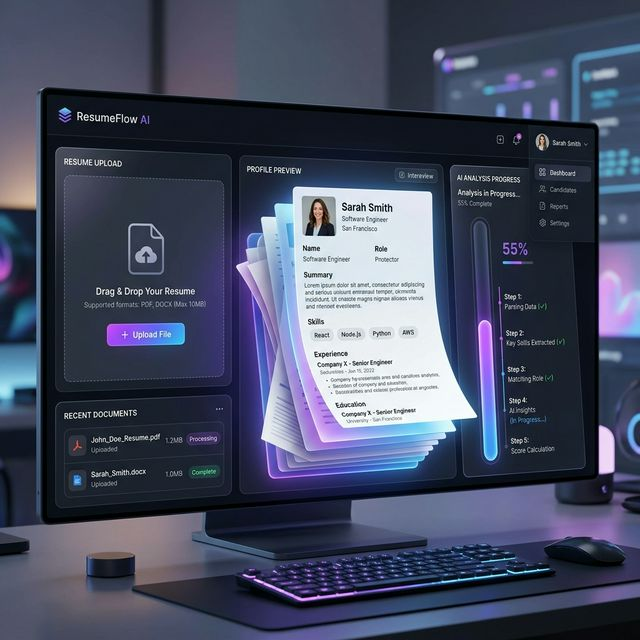
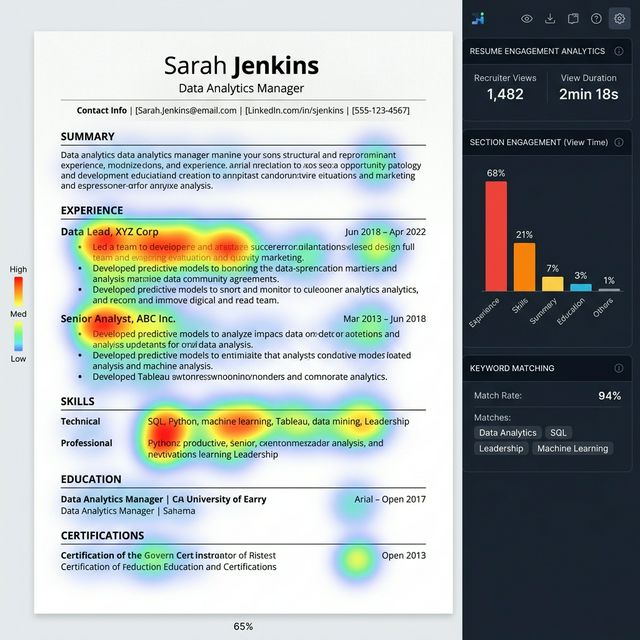

# 🚀 ResumeVerse: Your Resume. Two Powerful Tools.

> **Transform Your Resume into a Stunning Web Portfolio & Visualize Recruiter Engagement with AI-Powered Heatmaps.**



---

## 💡 The Problem
Traditional resumes are **static**, **boring**, and provide **zero feedback**. You send a PDF into a "black hole" and never know if a recruiter actually read it, or which parts they spent time on.

## ✨ The Solution: ResumeVerse
ResumeVerse brings your resume to life with two distinct, AI-driven features:

### 1. 🤖 AI Portfolio Generator
Upload your PDF or DOCX. Our AI (Gemini 1.5 Flash) extracts your experience, rewrites metric-driven STAR bullets, and deploys it as a **breathtaking interactive website** in seconds.
*   **3 Distinct Themes:** Choose from Bento (Modern Grid), Journey (Story-driven), or Terminal (Dev-focused).
*   **Fully Customizable:** Edit content and themes in real-time.

### 2. 📊 Smart Resume Analytics
Share your PDF through a trackable link and see exactly how recruiters engage.
*   **Activity Heatmaps:** Visualize exactly where recruiters are spending their time using D3-powered heatmaps.
*   **Real-time Metrics:** Track view counts, session duration, and geographical data.
*   **Recruiter Insights:** Know your strengths based on real interaction data.



---

## 🛠️ Tech Stack
This project is built using a modern, high-performance stack:

- **Frontend:** Next.js 14, React 19, TypeScript, Tailwind CSS
- **Design & UI:** shadcn/ui, Framer Motion, GSAP, Lenis (Smooth Scroll)
- **Data Viz:** D3.js, Recharts
- **AI Engine:** Google Gemini AI (1.5 Flash)
- **Backend / Auth:** Supabase (Database, Auth, Storage)
- **DevOps:** Docker, Vitest, GitHub Actions

---

## 🚀 Getting Started

### Prerequisites
- Node.js 20+
- A Google Gemini API Key
- A Supabase Project

### Installation
1.  **Clone the Repo**
    ```bash
    git clone https://github.com/your-username/resumeverse.git
    cd resumeverse
    ```

2.  **Environment Setup**
    Create a `.env.local` file:
    ```env
    NEXT_PUBLIC_SUPABASE_URL=your_url
    NEXT_PUBLIC_SUPABASE_ANON_KEY=your_key
    GEMINI_API_KEY=your_gemini_key
    ```

3.  **Run Development Server**
    ```bash
    npm install
    npm run dev
    ```

---

## 🌟 Why this Project?
This isn't just a resume builder. It's a demonstration of complex **full-stack integration**, **AI implementation**, and **advanced data visualization**. From parsing messy PDFs to rendering real-time heatmaps, ResumeVerse solves a real-world career communication problem with a premium aesthetic.

---

### Developed with ❤️ by [Your Name]
